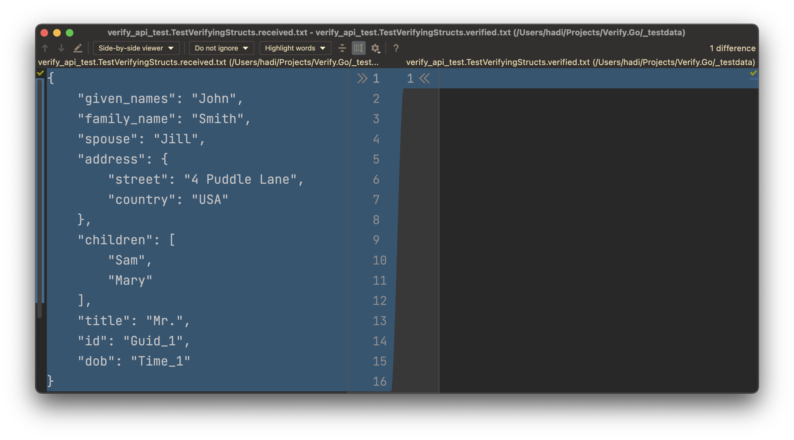
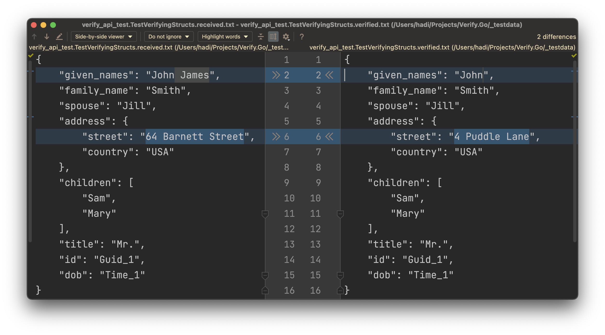

#  Verify.Go

[](https://github.com/VerifyTests/Discussions/discussions) [](https://github.com/VerifyTests/Verify.Go/actions?query=workflow%3Abuild) [](https://goreportcard.com/report/github.com/VerifyTests/Verify.Go) [](https://pkg.go.dev/github.com/VerifyTests/Verify.Go)

<!--
[](https://github.com/VerifyTests/Verify.Go/releases/latest)
-->

Verify.Go is a snapshot tool for Go language that simplifies the assertion of complex data models and documents.

Verify is called on the test result during the assertion phase. It serializes that result and stores it in a file that matches the test name. On the next test execution, the result is again serialized and compared to the existing file. The test will fail if the two snapshots do not match: either the change is unexpected, or the reference snapshot needs to be updated to the new result.

## Snapshot management

Accepting or declining a snapshot file is part of the core workflow of Verify. There are several ways to do this and the approach(s) selected is a personal preference.

 * Manually making the change in the launched diff tool. Either with a copy paste, or some tools have commands to automate this via a shortcut or a button.
 * Manually on the file system, by renaming the `.received.` file to `.verified.`. This can be automated via a scripted to bulk accept all (by matching a pattern) `.received.` files.

 ## Usage

 ### Struct being tested

Given a struct to be tested:

```go
var person = Person{
    ID:         uuid.MustParse("ebced679-45d3-4653-8791-3d969c4a986c"),
    Title:      Mr,
    FamilyName: "Smith",
    GivenNames: "John",
    Dob:        time.Date(2022, 02, 01, 1, 2, 3, 4, time.Local),
    Spouse:     "Jill",
    Address: Address{
        Street:  "4 Puddle Lane",
        Country: "USA",
    },
    Children: []string{"Sam", "Mary"},
}
```

### Go Tests

Tests are created using standard Go test functions. A test file named `verify_api_test.go` can have following Test function:

```go
import (
	"github.com/VerifyTests/Verify.Go/verifier"
)

func TestVerifyingStructs(t *testing.T) {
    verifier.Verify(t, person)
}
```

### Initial Verification

When the test is initially run will fail. If a diff tool is detected it will display the diff.



To verify the result:

 * Use the diff tool to accept the changes, or
 * Manually copy the text to the new file

### Verified result

This will result in the `TestFile.TestVerifyingStructs.verified.txt` being created:

```txt
{
    "given_names": "John",
    "family_name": "Smith",
    "spouse": "Jill",
    "address": {
        "street": "4 Puddle Lane",
        "country": "USA"
    },
    "children": [
        "Sam",
        "Mary"
    ],
    "title": "Mr.",
    "id": "Guid_1",
    "dob": "Time_1"
}
```

### Subsequent Verification

If the implementation of the struct changes:

```go
var person = Person{
    ID:         uuid.MustParse("ebced679-45d3-4653-8791-3d969c4a986c"),
    Title:      Mr,
    FamilyName: "Smith",
    GivenNames: "John James",
    Dob:        time.Date(2022, 02, 01, 1, 2, 3, 4, time.Local),
    Spouse:     "Jill",
    Address: Address{
        Street:  "64 Barnett Street",
        Country: "USA",
    },
    Children: []string{"Sam", "Mary"},
}
```

And the test is re run it will fail.

The Diff Tool will display the diff:



The same approach can be used to verify the results where the change to `*.verified.*` is committed to source control along with the change to the struct.

## Received and Verified

 * **All `*.verified.*` files should be committed to source control.**
 * **All `*.received.*` files should be excluded from source control.**

## Verify Settings

Settings can be changed by creating an instance of `VerifySettings` interface and using the method that accepts a setting. Default setting will be used otherwise.

```go
func TestVerifyingString(t *testing.T) {
    settings := NewSettings()
    
    settings.AddScrubber(func(str string) string {
		return strings.ReplaceAll(str, "String to verify", "new value")
	})

    verifier.VerifyWithSetting(t, settings, "String to verify")
}
```

## Versioning

Verify follows [Semantic Versioning](https://semver.org/). Small changes in the resulting snapshot files may be deployed in a minor version. As such updates to `Verify.Go` should be done as follows:

 * Updates `Verify.Go` packages in isolation
 * Re-run all tests.
 * If there are changes, ensure they look correct given the release notes. If the changes do not look correct, raise an issue.
 * Accept those changes.

Snapshot changes do not trigger a major version change to avoid causing [Diamond dependency](https://en.wikipedia.org/wiki/Dependency_hell#Problems) issues for downstream extensions.


## More Documentation

- This is a work in progres...

## Icon

[Go](https://thenounproject.com/term/go/4114128/) designed by [Jonata Hangga](https://thenounproject.com/stan82ly/) from [The Noun Project](https://thenounproject.com).